# Serverless Image Processing Pipeline on AWS

This project implements a fully automated, event-driven pipeline on AWS to process images in real-time. It's designed to solve a common business problem for web applications like e-commerce sites, where multiple versions of an image (e.g., thumbnails, web-optimized) are needed automatically upon upload.

## Architectural Diagram

The architecture is 100% serverless and event-driven. An image upload to the source S3 bucket triggers a Lambda function that performs the resizing and saves the results to a destination bucket.

```mermaid
graph TD;
    subgraph "User's Action"
        A[👤 User] -- Uploads image (.jpg, .png) --> B((Source S3 Bucket));
    end

    subgraph "AWS Automated Workflow"
        B -- S3 Event Trigger --> C{⚙️ AWS Lambda Function};
        C -- Processes Image --> D((Destination S3 Bucket));
    end

    subgraph "Processed Images"
        D -- Stores --> E[🖼️ Thumbnail Version];
        D -- Stores --> F[🖼️ Web-Optimized Version];
    end

    style B fill:#FF9900,stroke:#333,stroke-width:2px
    style D fill:#FF9900,stroke:#333,stroke-width:2px
    style C fill:#5A30B5,stroke:#FFF,stroke-width:2px,color:#FFF
```



## Problem Solved

In many applications, developers need to manually resize images, which is slow, error-prone, and not scalable. This pipeline automates the entire workflow, ensuring that images are processed instantly, consistently, and cost-effectively.

## Features

  - **Fully Automated**: Image processing is triggered automatically on upload.
  - **Serverless & Scalable**: Built on AWS Lambda and S3, it scales from zero to thousands of requests automatically.
  - **Infrastructure as Code**: The entire infrastructure is provisioned and managed using Terraform for repeatable and reliable deployments.
  - **Secure by Design**: Follows the principle of least privilege with granular IAM roles and private S3 buckets.

## Technology Stack

  - **Cloud Provider**: AWS
  - **Core Services**: S3, Lambda, IAM, CloudWatch
  - **Infrastructure as Code**: Terraform
  - **Application Code**: Python 3.9
  - **Libraries**: Boto3, Pillow

## Setup and Deployment

Follow these steps to deploy the infrastructure on your own AWS account.

### Prerequisites

1.  An AWS Account with programmatic access.
2.  [Terraform](https://learn.hashicorp.com/tutorials/terraform/install-cli) installed on your local machine.
3.  [Python 3.9](https://www.python.org/downloads/) installed.
4.  [Git](https://git-scm.com/downloads) installed.

### Deployment Steps

1.  **Clone the repository:**

    ```bash
    git clone https://github.com/your-username/your-repo-name.git
    cd your-repo-name
    ```

2.  **Configure your AWS Credentials:**
    Make sure your AWS CLI is configured with credentials that have permissions to create the resources in the Terraform files.

    ```bash
    aws configure
    ```

3.  **Package the Lambda Function:**
    This script will install dependencies and create a `.zip` file for the Lambda function.

    ```bash
    # On Windows, use Git Bash to run this command
    bash package.sh
    ```

4.  **Deploy the Infrastructure:**
    Navigate to the `terraform` directory and run the following commands.

    ```bash
    cd terraform
    terraform init
    terraform apply --auto-approve
    ```

## How to Use

1.  After deployment, Terraform will output the `source_bucket_name`.
2.  Navigate to the AWS S3 console and find this bucket.
3.  Upload a `.jpg` or `.png` image into the bucket.
4.  Check the `destination_bucket_name`. The resized images will appear in the `thumbnails/` and `web/` folders within seconds.

## Clean Up

To avoid ongoing charges, destroy the resources when you are finished.

**IMPORTANT:** You must manually delete the objects inside the S3 buckets before Terraform can destroy the buckets themselves.

1.  Navigate to the `terraform` directory.
2.  Run the destroy command:
    ```bash
    cd terraform
    terraform destroy --auto-approve
    ```
