Here is a comprehensive documentation record for your project.

-----

## Project Record: Automated Image Processing Pipeline

  * **Project Name:** Serverless Image Processing Pipeline on AWS
  * **Date Created:** September 2025
  * **Author:** (Your Name)
  * **Version:** 1.0

### 1\. Project Summary

This project implements a fully automated, event-driven pipeline on AWS to process images in real-time. It solves the common business need for creating multiple versions of an image (e.g., thumbnails, web-optimized) automatically upon upload. The entire infrastructure is managed via **Infrastructure as Code (Terraform)**, and the architecture is 100% serverless, ensuring scalability and cost-effectiveness.

### 2\. Final Architecture

The final architecture is an event-driven workflow utilizing core AWS serverless components.

  * **Trigger:** An image upload to a source S3 bucket.
  * **Compute:** An AWS Lambda function processes the image.
  * **Storage:** Processed images are stored in a destination S3 bucket.

```mermaid
graph TD;
    A[👤 User] -- Uploads Image --> B((Source S3 Bucket));
    B -- S3 Event Trigger --> C{⚙️ AWS Lambda};
    C -- Creates Resized Versions --> D((Destination S3 Bucket));

    style B fill:#FFC107,stroke:#000000,stroke-width:2px
    style D fill:#FFC107,stroke:#000000,stroke-width:2px
    style C fill:#5A30B5,stroke:#FFFFFF,stroke-width:2px,color:#FFFFFF
```

<!-- end list -->

### 3\. File and Code Breakdown

#### 3.1. `src/lambda_function.py`

This Python script contains the core application logic. It uses the **Pillow** library to perform image manipulation.

  * **Function:** `lambda_handler(event, context)`
  * **Action:**
    1.  Receives an S3 event notification.
    2.  Downloads the source image from the source S3 bucket.
    3.  Resizes the image into a thumbnail and a web-optimized version in memory.
    4.  Uploads the two new versions to the destination S3 bucket.

#### 3.2. `package.sh`

This is a shell script designed to automate the packaging of the Lambda function for deployment.

  * **Action:**
    1.  Creates a clean `dist/` directory.
    2.  Installs Python dependencies from `requirements.txt` into a temporary `package/` folder.
    3.  Zips the dependencies and the `lambda_function.py` script into a single `dist/image_processor.zip` file, ready for Terraform to deploy.

#### 3.3. `terraform/`

This directory contains all the Infrastructure as Code definitions.

  * **`main.tf`**: Defines all AWS resources: two S3 buckets (source and destination) with public access blocked, a least-privilege IAM Role and Policy for the Lambda function, the Lambda function itself (with 512MB memory and a 90s timeout), and the S3 event trigger.
  * **`variables.tf`**: Defines input variables (`aws_region`, `project_name`) to make the code reusable.
  * **`providers.tf`**: Specifies the AWS provider for Terraform.
  * **`outputs.tf`**: Configures Terraform to output the final S3 bucket names after deployment.

### 4\. Key Decisions & Troubleshooting Log

  * **Initial Environment Issues (Local Windows):**

      * **Problem:** `pip`, `python`, and `py` commands were not found when running `package.sh` in the Git Bash terminal.
      * **Root Cause:** A mismatch between the PATH environment variable in Windows Command Prompt and the Git Bash shell, particularly with a Microsoft Store Python installation.
      * **Resolution:** Switched the primary development environment to **AWS CloudShell**, which provides a standard Linux environment with all necessary tools pre-installed, resolving all path conflicts.

  * **Terraform Installation Conflict:**

      * **Problem:** The `unzip` command for Terraform failed due to a name conflict.
      * **Root Cause:** Attempting to unzip a file named `terraform` inside the project's root directory, which already contained a folder named `terraform`.
      * **Resolution:** Performed the Terraform download and installation in the home (`~`) directory, a neutral location, before returning to the project folder to run `terraform apply`.

  * **Lambda Timeout Error:**

      * **Problem:** The Lambda function failed with a `Status: timeout` error on the second, larger image upload.
      * **Root Cause:** The initial 128 MB memory allocation was insufficient, providing minimal CPU power and causing the function to exceed its 30-second timeout.
      * **Resolution:** Updated `main.tf` to increase the Lambda function's resources to **512 MB of memory** and a **90-second timeout**, allowing it to process larger images efficiently.

### 5\. Future Enhancements

  * **Add a Frontend:** Create a simple static webpage hosted on S3 that allows users to upload images and receive download links for the processed versions. This would require adding an **API Gateway** and a new "uploader" Lambda function to generate S3 presigned URLs.
  * **Cost Optimization:** Implement **S3 Lifecycle Policies** to transition old, raw images in the source bucket to cheaper storage classes like S3 Glacier.
  * **Enhanced Notifications:** Extend the processing Lambda to publish a completion message to an **SNS topic**, allowing other services to be notified when an image has been successfully processed.